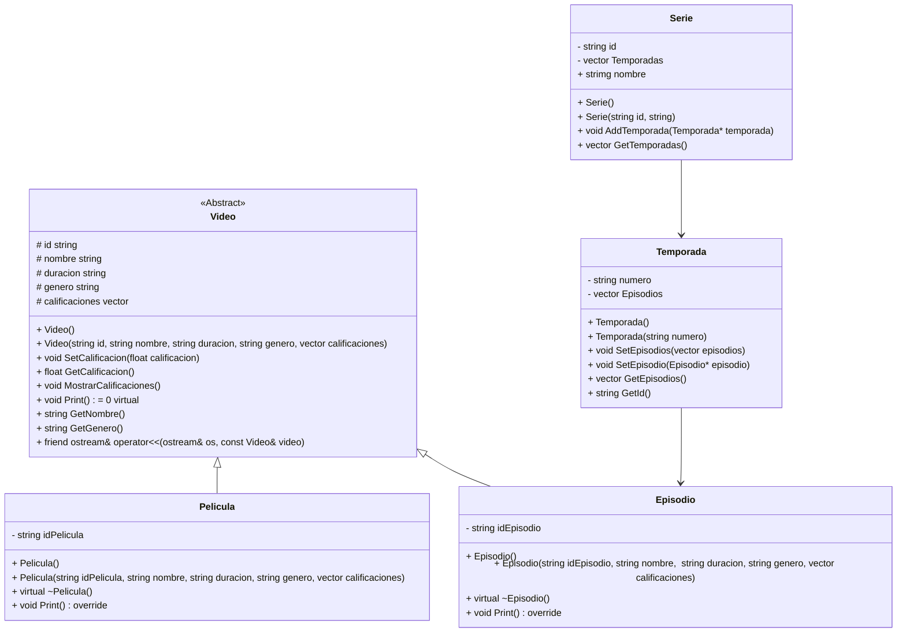

# Situation Problem - Video Streaming App

## Streaming service modeling
In recent years, video-on-demand streaming services have proliferated, such as Netflix, Disney, DC, among others. Some of them specialize in the volume of videos they provide to their users while others have challenged themselves to only show videos of their own brand. A limited version to support a future provider of this type of service is described below:

You want to work with two types of videos: movies and series. Every video has an ID, a name, a duration and a genre (drama, action, mystery).

The series have episodes and each episode has a title and season to which it belongs.

We are interested in knowing the average rating that each of the videos has received. This rating is on a scale of 1 to 5 where 5 is the best rating.

The system must be able to:

- Show the videos in general with their ratings
- Show the episodes of a certain series with their ratings
- Show movies with their ratings

What would be the class diagram that would represent the situation posed?

How would you use Object Oriented Programming concepts such as inheritance, polymorphism, and operator overloading to build the class system that would facilitate solving the problem situation?

Could you build an application that takes information about the different types of videos and generates reports such as: movies of a certain genre, series of a certain genre, movies with their rating?

# What do I have to do?
To achieve the activity, the following actions must be carried out:

- Read the problem situation.
- Identify the objects involved and define their characteristics and behaviors for each of them.
- Design a class model that provides a solution to the problem situation. Verify that the model uses the mechanisms of Inheritance and Polymorphism.
- Prepare the UML Diagram that represents the design of the solution.
- Build class design proposed in the programming language. Ensure that the built class system works correctly by making an application program for that purpose.
- Design and develop an application that uses the built class system to solve the problem situation.


The application should display the following looped menu:
1. Load data file
2. Show the videos in general with a certain rating or of a certain genre
3. Show the episodes of a certain series with a certain rating
4. Show movies with a certain rating
5. Rate a video
request title to qualify
ask for value granted
0.exit
The system must validate all inputs given by the user.

## UML Diagram

I create my Class Diagram for my solution here, using [Lenguaje Mermaid](https://mermaid.js.org/syntax/classDiagram.html).


This editor can also help you [Mermaid-live](https://mermaid.live/).

# Diagrama de clases UML con draw.io
El repositorio está configurado para crear Diagramas de clases UML con ```draw.io```. Para usarlo simplemente agrega un archivo con extensión ```.drawio.png```, das doble clic sobre el mismo y se activará el editor ```draw.io``` incrustado en ```VSCode``` para edición. Asegúrate de agregar las formas UML en el menú de formas del lado izquierdo (opción ```+Más formas```).

Para más información consulta el [MarketPlace](https://marketplace.visualstudio.com/items?itemName=hediet.vscode-drawio).

# Trabajo en Equipo

Revisa [LiveShare](https://youtu.be/9QXwSg9-2qQ). Revisa el [uso de LiveShare](https://www.youtube.com/watch?v=nj535VbE9pQ). Disponible para este repositorio.

# Trabajo en Equipo - Avanzado

Puedes trabajar en equipo siguiendo el workflow de GitHub basado en Pull Request. Esta es una forma avanzada de trabajo en equipo que puedes revisar en el siguiente [Video](https://www.youtube.com/watch?v=Zqft6yNRuNs). Para hacerlo considera lo siguiente: (1) En lugar de hacer un ```Fork``` del repositorio al que quieres contribuir a tu perfil personal, hazlo a la organización y (2) En lugar de clonar el repositorio ```Fork``` -como indica el video- crea un Codespace sobre el mismo y programa ahí tu contribución.

** Nota: los repositorios ```Fork``` de los miembros que trabajen así aparecerán en la pestaña ```Repositories``` del mismo.

# Ejecución de la App

### Compile+Run commands
```
make
```
### Compile command
```
make compile
```
### Run command
```
make run
```

### Clean command
```
make clean
```
### Debug command - Command Line
```
make debug
```
Mini-tutorial : https://u.osu.edu/cstutorials/2018/09/28/how-to-debug-c-program-using-gdb-in-6-simple-steps/

### Debug command - VS Code
```
make debugvs
```
