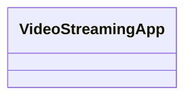

# Situación Problema - App de VideoStreaming

## Modelado de servicio de streaming
En los últimos años, han proliferado los servicios de streaming de video bajo demanda por ejemplo Netflix, Disney, DC entre otros. Algunos de ellos se especializan por el volumen de videos que proporcionan a sus usuarios mientras que otros se han puesto el reto de mostrar solamente videos de su propia marca. Una versión limitada para apoyar a un futuro proveedor de este tipo de servicios es la que se describe a continuación:

Se quiere trabajar con dos tipos de videos: películas y series. Todo video tiene un ID, un nombre, una duración y un género (drama, acción, misterio).

Las series tienen episodios y cada episodio tiene un título y temporada a la que pertenece.

Nos interesa conocer la calificación promedio que ha recibido cada uno de los videos. Esta califiación está en escala de 1 a 5 donde 5 es la mejor calificación.

El sistema debe ser capaz de :

- Mostrar los videos en general con sus calificaciones
- Mostrar los episodios de una determinada serie con sus calificaciones
- Mostrar las películas con sus calificaciones

¿Cuál sería el Diagrama de clases que representaría la situación planteada?

¿Cómo emplearías los conceptos de Programación Orientada a Objetos tales como herencia, polimorfismo y sobrecarga de operadores para construir el sistema de clases que facilitaría la solución de la situación problema?

¿Podrías construir una aplicación que tome la información sobre los diferentes tipos de videos y genere reportes como: películas de un cierto género, series de un cierto género, películas con su calificación ?

# ¿Qué tengo que hacer?
Para el logro de la actividad, se deben realizar las siguientes acciones :

- Leer la situación problema.
- Identificar los objetos involucrados y definir para cada uno de ellos sus características y comportamientos.
- Diseñar un modelo de clases que de solución a la situación problema. Verificar que el modelo emplee los mecanismos de Herencia y Polimorfismo.
- Elaborar el Diagrama UML que represente el diseño de la solución.
- Construir diseño de clases propuesto en el lenguaje de programación. Asegurar que el sistema de clases construido funciona correctamente haciendo un programa de aplicación para ese fin.
- Diseñar y elaborar una aplicación que emplee el sistema de clases construido para dar solución a la situación problema.


La aplicación debe mostrar el siguiente menu ciclado:
1. Cargar archivo de datos
2. Mostrar los videos en general con una cierta calificación o de un cierto género
3. Mostrar los episodios de una determinada serie con una calificacion determinada
4. Mostrar las películas con cierta calificacion
5. Calificar un video
pedir titulo a calificar
pedir valor otorgado
0. Salir
El sistema debe validar todas las entradas dadas por el usuario.

## Diagrama de Clases

Construye aquí el Diagrama de Clases de tu solución, usando el [Lenguaje Mermaid](https://mermaid.js.org/syntax/classDiagram.html).


Puedes apoyarte con el editor [Mermaid-live](https://mermaid.live/).

# Trabajo en Equipo

Revisa [LiveShare](https://youtu.be/9QXwSg9-2qQ). Revisa el [uso de LiveShare](https://www.youtube.com/watch?v=nj535VbE9pQ). Disponible para este repositorio.

# Ejecución de la App

### Compile+Run commands
```
make
```
### Compile command
```
make compile
```
### Run command
```
make run
```

### Clean command
```
make clean
```
### Debug command - Command Line
```
make debug
```
Mini-tutorial : https://u.osu.edu/cstutorials/2018/09/28/how-to-debug-c-program-using-gdb-in-6-simple-steps/

### Debug command - VS Code
```
make debugvs
```